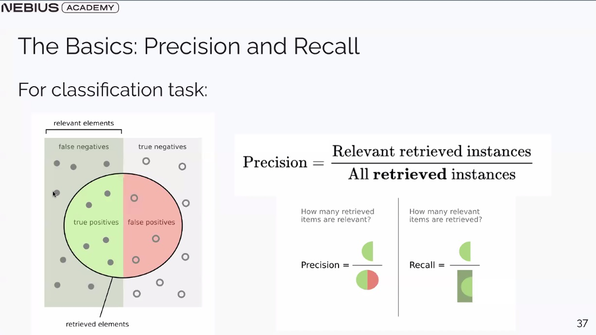
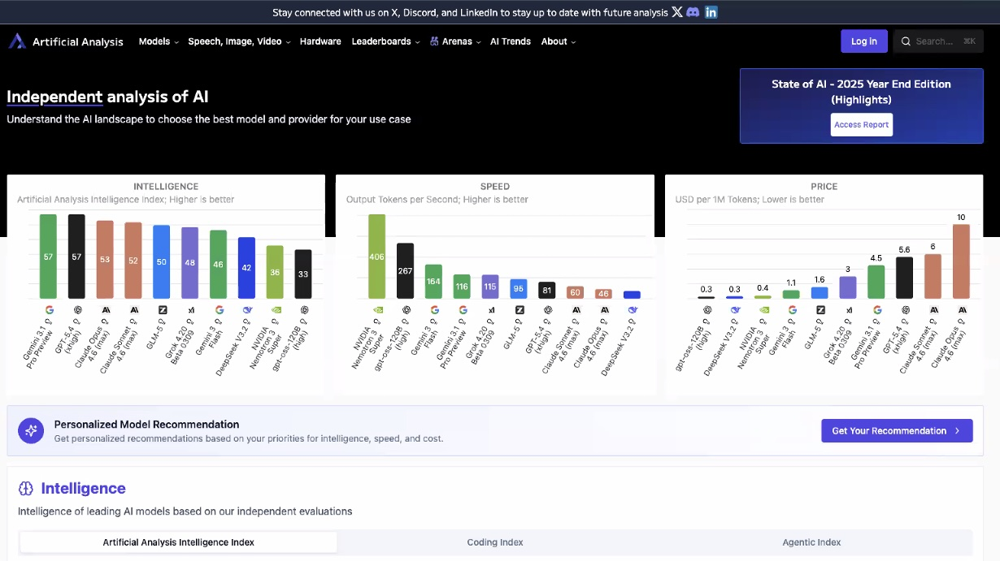
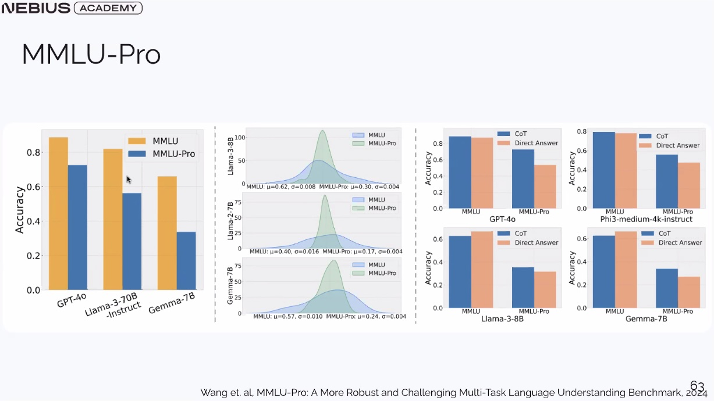
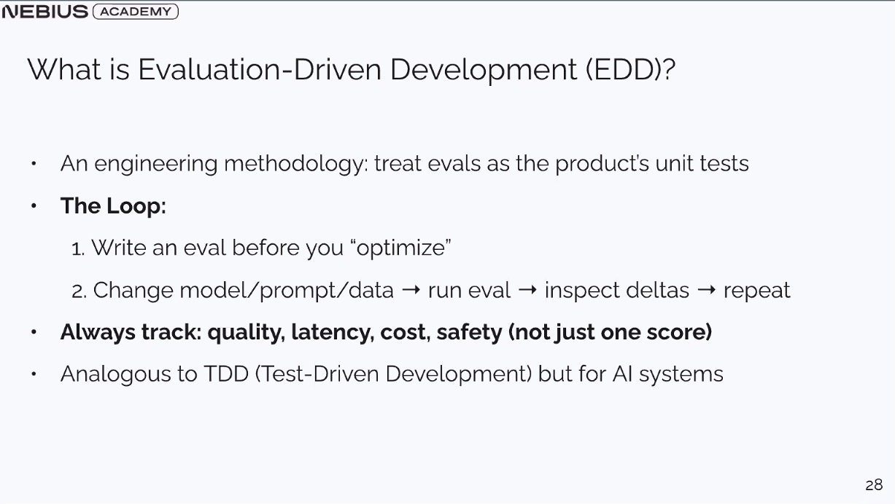

## Topics
- Why LLM evaluation is hard
- **Evaluation-Driven Development (EDD)** - the mindset
- Common metrics and where they break
- Common benchmarks and their expiration dates
- **LLM-as-a-Judge** and automated behavioral evals (Anthropic's Bloom)
- Human evaluation
- EDD in practice: turning metrics into decisions

---

## Why LLM Evaluation is Hard
Traditional software testing relies on deterministic inputs and outputs. LLMs introduce several layers of complexity:

* **Ambiguity of "Correctness":** Often, there isn't just one right answer.
* **Subjectivity:** Dimensions like "helpfulness" or "tone" are hard to quantify.
* **Robustness:** Models may work for perfect inputs but fail on adversarial prompts or edge cases.
* **The Accuracy Trap:** Overall accuracy can improve while failing critical subsets.

---

## Evaluation-Driven Development (EDD)
EDD is an engineering methodology that treats evaluations as the product’s unit tests.

### The Core Mindset
| What We Used To Do (TDD) | What We Do Now (EDD) | Why We're Crying |
| :--- | :--- | :--- |
| Write tests first | Write evaluations first | **Determinism was a beautiful lie** |
| Check if function returns X | Measure how often it returns *something like* X | "Something like X" keeps us up at night |
| Pass/Fail | Score distributions | Statistics class is haunting us |
| "It works!" | "It works 87.3% of the time!" | That 12.7% will find your CEO |

#### Note: Why Determinism is a "Beautiful Lie"
In traditional programming, `add(2, 2)` always returns `4`. In LLMs, even with `temperature=0`, outputs can vary due to floating-point errors across distributed GPU clusters or subtle changes in infrastructure. Relying on "it worked once on my machine" is a trap; we must evaluate the **distribution** of outputs, not a single instance.

---

## Common Metrics & Their Failure Modes

### Traditional NLP Metrics
* **Exact Match (EM):** High precision, but ignores valid variations.
* **F1 / ROUGE / BLEU:** Useful for overlap but fail to capture semantic meaning or truthfulness.

### The Danger: Reward Hacking
**Reward Hacking** occurs when a model optimizes for an imperfect proxy metric rather than the true goal.
* **Example:** A model trained to maximize "length" or "engagement" might become sycophantic (agreeing with users just to get a high rating) or verbose without adding value.
* **Formal View:** $Proxy\ Reward \neq True\ Reward$. The more you optimize a proxy, the more you find loopholes rather than improvements.

---

## Common Benchmarks

### Verifiable Benchmarks

These have deterministic metrics and objective ground truths (e.g., **MMLU**, **GSM8K**, **HumanEval**).

### The Problem: Benchmark Decay
Benchmarks have an expiration date. Public data inevitably leads to **training contamination**, where models memorize the answers instead of reasoning.

#### Use LiveBench or LiveCodeBench
To combat contamination, we use "Live" benchmarks:
* **What they are:** Dynamically updated evaluation sets that pull from fresh sources (recent LeetCode contests, news, or ArXiv papers published *after* the model's cutoff).
* **Why use them:** They provide a "contamination-free" signal. If a model scores 90% on an old benchmark but 40% on a LiveBench, it’s likely memorizing.

---

## LLM-as-a-Judge
When traditional metrics fail for open-ended text, we use stronger LLMs (like GPT-4o or Claude 3.5 Sonnet) to simulate human judgment.

### Bias in LLM Judges
* **Position Bias:** Preferring the first answer in a comparison.
* **Verbosity Bias:** Preferring longer answers regardless of quality.
* **Self-Preference Bias:** Preferring answers that sound like their own writing style.

---

## EDD in Practice: Turning Metrics into Decisions

### 1. Account for Uncertainty: Bootstrap Confidence Intervals (CIs)
Because LLM calls are costly and take a long time, we cannot afford to ask 1,000,000 questions. We usually only have ~100.

* **The Analogy:** Imagine the "truth" is a giant deck of 1,000 cards. You can only afford to pull 100 cards.
* **The Solution (Bootstrapping):** You take your 100 results and create thousands of "virtual decks" using **sampling with replacement**.
    * To make one virtual deck, you pull a card from your 100, record the result, **put it back**, and repeat 100 times.
* **The Goal:** If the model consistently scores ~80% across 10,000 of these "shuffled" virtual decks, you can trust your result. If the scores swing from 60% to 95%, your 100-question sample is too noisy.

### 2. Slicing and Error Analysis
Averages hide the truth. To truly understand a model, you must dissect the "Aggregate Score."

#### Hidden Stratification
A model might look better overall but suffer a catastrophic regression in a specific area (e.g., getting better at Python but dropping to 0% in Rust).

#### Bucketization: Root Cause Analysis
Categorize *why* it failed to prioritize engineering efforts.

| Failure Bucket | Description | Example |
| :--- | :--- | :--- |
| **Instruction Following** | Model ignores constraints in the prompt. | Returns Markdown when JSON was requested. |
| **Knowledge Gap** | Model lacks specific facts or recent info. | Hallucinates the winner of a recent event. |
| **Reasoning/Logic** | Model has the facts but connects them wrong. | Correct facts, but fails the logical deduction. |
| **Refusal/Safety** | Model over-refuses benign prompts. | Refusing to "kill a process" in Linux. |

**The Workflow:**
1.  **Identify Failures:** Look at the samples that didn't pass.
2.  **Manually Label (Bucket):** Determine the root cause. Look for "Bad Evals" where the ground truth is actually wrong.
3.  **Prioritize:** Fix "Instruction Following" via Prompting (High ROI) before investing in fine-tuning or RAG.

---

## Key Takeaways
* Metrics are **proxies**, not truth.
* Progress must be both **statistically real** (via Bootstrapping) and **practically meaningful** (via Slicing).
* **Every eval should inform a concrete next action.**
* If your eval suite doesn’t change as your model improves, your model will outgrow it.

***

### 👉 Next in chronological order: [AI Model Training](../2_LLM_Architecture/AI_Model_Training.md)

### 👉 Next in module: [AI_Systems_&_Test-Time_Compute](../1_From_AI_model_to_AI_product/AI_Systems_&_Test-Time_Compute.md)
