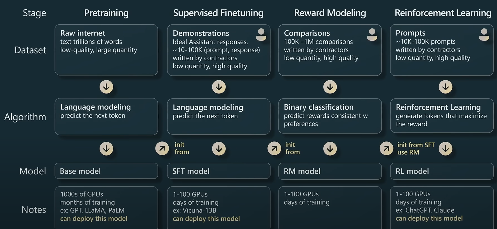
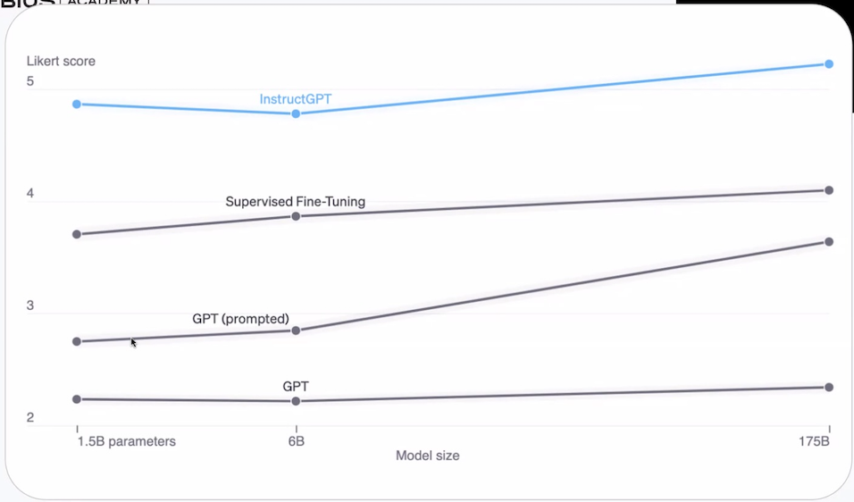
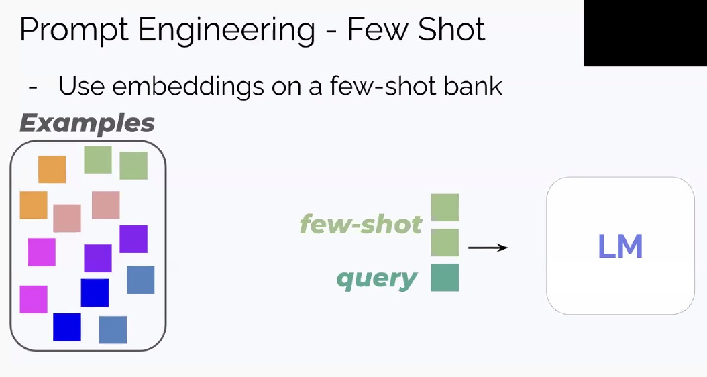
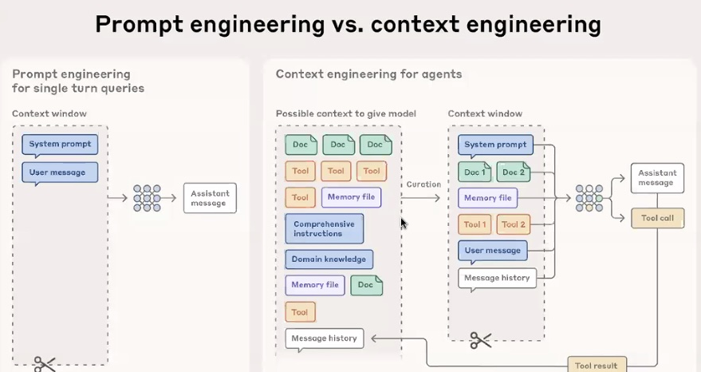

# Topics

- What changed with LLMs (and what didn't)
- LLM APIs and the model landscape
- Core limitations: hallucinations, non-determinism
- Reasoning and chain-of-thought

## Status quo of Transformers and GPT
- GPT predicts the next token
- Types of models: Base, Chat, Instruct
- Each model has it's own use-cases and formats

### Key insights
- Base model is basically a compressed version of the internet
- It takes much less resources to train SFT models than base models

## Supervised Fine-Tuning (SFT)
- SFT: Teaching by Demonstration
- Human annotators write ideal responses to prompts
- Model learns to mimic human style and behavior

### Key insights
- We're no longer predicting internet text - we're predicting what a helpful assistant would say
- The Cost of Alignment: Performance on benchmarks like MMLU and HumanEval drops significantly (8–33%).
- Utility over Accuracy: Models trade technical benchmark scores for better assistant behavior.
- User Preference: Despite lower test scores, users find aligned models more helpful in practice.

## GPT Assistant training pipeline

- Pretraining
- Supervised Finetuning (SFT)
- Reward Modeling (RM)
- Reinforcement Learning from Human Feedback (RLHF)

### Key insights
- SFT is relatively cheap and fast
- RLHF is expensive and slow

### Mapping the OpenAI Lineage to the Pipeline

OpenAI Model Label | Training Stage | Data Source
---|---|---
GPT | Pretraining | Trillions of words from the raw internet.
GPT (prompted) | (Inference Hack) | Clever prompt engineering on the base model.
SFT Model | Supervised Fine-Tuning | ~10k–100k human-written demonstrations.
InstructGPT | Reinforcement Learning | Human rankings and Reward Modeling (RM).

## Tokenization strategies

- Space-based tokenization:
["Don't", "you", "Love", "Transformers?", "We", "sure", "do."]
This does not capture that "don't" means "do not".

- Byte-based tokenization:
["Don", "'", "t", "you", "Love", "Transformers", "?", "We", "sure", "do", "."]
This captures that "don't" means "do not" but it is not very efficient.

- Byte-Pair Encoding (BPE):
["Don", "'t", "you", "Love", "Transformers", "?", "We", "sure", "do", "."]
This captures that "don't" means "do not" and it is efficient.

## Token Economics

- Input tokens are cheaper than output tokens (2-4x), because input is processed in parallel, output is sequential
- Example pricing (order of magnitude): GPT-5.4 = $2.50/M
input, $15/M output. GPT-5-mini = 10x cheaper. Open models on marketplaces cheaper still.
- A typical chatbot turn = 500 input + 200 output = 700 tokens = $0.004/turn at GPT-5.4 prices
- At 1M turns/day → ~$4K/day. This

## Prompt Engineering

### Zero Shot

- Direct the model to sample from the right modality

Example:

> You are a distinguished researcher who likes to provide thorough explanations to any scientific question.  
> Describe the shape of the earth:  
> The Earth is an oblate spheroid, meaning that it is slightly flattened at the poles and bulges at the equator. This shape is due to the Earth's rotation, which causes it to bulge at the equator.

- For flat-Earth believers the prompt would be like:

> You are a flat-Earth believer.  
> Describe the shape of the earth:  
> The Earth is flat....

### Few Shot

- Provide examples of the desired output format
- Use few-shot examples to guide the model's response

### Chain-of-Thought

- Ask the model to think step by step - this is mostly default in latest models
- Use chain-of-thought to improve reasoning

### IDK

- Allow the model to say "I don't know", Specifically state to the model you permit it to not return an answer. This reduces hallucinations.

- BAD: Why did revenue increase, according to the following quarterly report? 
{Quarterly Report}

- BETTER: Why did revenue increase, according to the following quarterly report? If the answer is not in the report, say "I don't know". 
{Quarterly Report}

### The IDH Template (Instruction - Data - Hint)

#### When the task is complicated consider providing an example.
**NOTE: this may result in a great output bias according to your examples.**

BAD | MAYBE BETTER
---|---
Your task is to fix the product description to be compliant with the product guidance.      Original product description: (Product Description) End of Description  Product Guidance: (VERY COMPLEX Product Guidance) End of Description  The rewrite product description in accordance with the product guidance: | Your task is to fix the product description to be compliant with the product guidance.  **Here is an example of a product description according to the guidance:** {example}  Original product description: {Product Description} End of Description  Product Guidance: {VERY COMPLEX Product Guidance} End of Description  The rewrite product description in accordance with the product guidance:

## Chain-of-Thought Prompting

- Ask the model to "think step by step" before giving a final answer
- *Dramatically* improves performance on math, logic, and multi-step reasoning tasks
- Why it works: forces the model to allocate more tokens (= more computation) to the problem before committing to an answer
- Tip: for classification tasks, ask the model to output reasoning before the label - not after (order matters due to autoregressive generation)

## Prompt Engineering - Few Shot

> A good name for a song: 
> I want it that way 
> ## 
> A good name for a song: 
> It's gonna be me 
> ## 
> A good name for a song: 
> **I kissed a girl** 
> ## 

## Dynamic Few-Shot Prompting (Retrieval-Augmented Prompting)

- The Problem: You have a "bank" of 1,000+ high-quality examples, but they won't all fit into the model's limited context window.

- The Embedding Solution: You convert all examples in your "bank" into mathematical vectors (embeddings) and store them in a vector database.

- Semantic Retrieval: When a user sends a new query, the system turns that query into an embedding and searches the database for the 3–5 most similar examples.

- Dynamic Injection: The system automatically injects only those relevant examples into the prompt "just-in-time," providing the model with the most specific demonstrations for that exact task.

- Outcome: This maximizes performance by giving the model "relevant" guidance while minimizing token costs and avoiding "distraction" from irrelevant examples.

## Prompt vs Context engineering

The diagram illustrates the shift from writing a better "question" to building a better "information system."

- Prompt Engineering (Left): This is for simple, one-off tasks. You focus on the wording of the System Prompt and the User Message. It’s like giving a clear instruction to a person who has no tools or memory.

- Context Engineering (Right): This is for AI Agents. Instead of just a prompt, you build a "curation" layer that dynamically selects what the model sees:

    - Documents (RAG): Pulling only the relevant parts of a manual or codebase.

    - Tools: Showing the model which "functions" (like a calculator or API) it can use.

    - Memory Files: Giving the agent a "scratchpad" to remember what it did 10 steps ago.

    - History Management: Pruning old messages so the model doesn't get confused or run out of space (the "scissors" icon at the bottom).

## Tools / Function Calling in 30 Seconds

- You can define functions the model can "call" - it outputs a structured request, your code executes it, and the result goes back into context
- Examples: search the web, query a database, check inventory, send an email
- The model doesn't execute code - it decides which tool to call and with what parameters. Your application runs the tool and feeds back the result.
- This is how agents work - the model reasons about what to do, calls tools, sees results, reasons again

## My 2 cents

- Use English for prompts (more fits into context window, better performance, less expensive)
- Use RAG extensively to improve accuracy and reduce hallucinations
- Use tools for complex tasks

***

### 👉 Next: [LLM Architecture](../2_LLM_Architecture/AI_and_LLM_Intro.md)
