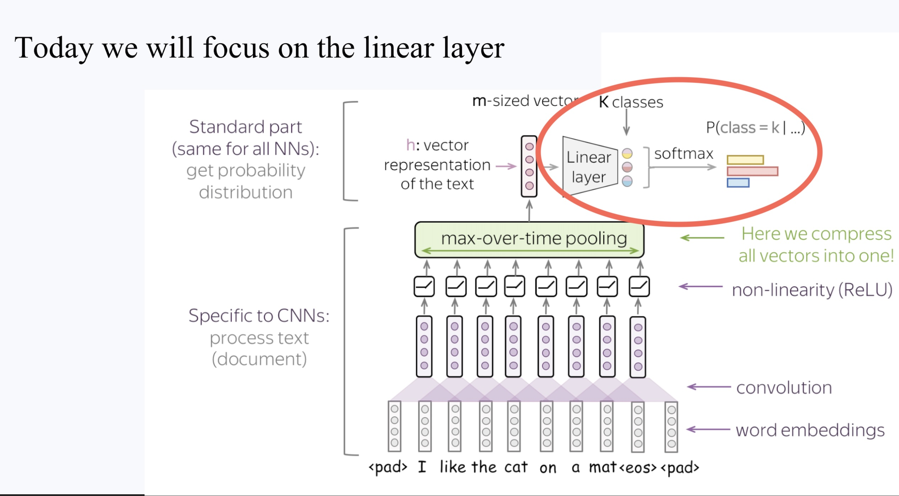
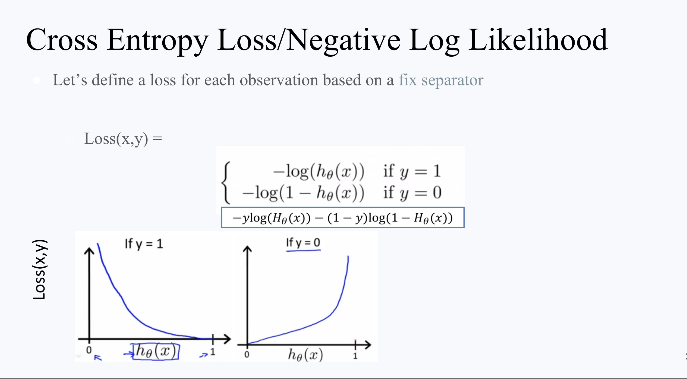

# AI Model Training

### Agenda
- Core Terminology & Hierarchy
- Language Model Architectures
- Optimization & Regularization
- Evaluation & Benchmarks

## 1. Machine Learning Fundamentals

### **The landscape of AI is divided into distinct learning paradigms and modeling goals.**

### Core Terminology & Hierarchy

* Artificial Intelligence (AI): The broad umbrella of giving computers the ability to understand and interact with humans.
* Machine Learning (ML): A sub-field of AI where models learn from examples to predict patterns in unseen data.
* Discriminative vs. Generative AI:
    1. Discriminative: Models that classify or predict specific values (e.g., separating two classes of data points).
    2. Generative: Models that generate new, unseen examples by sampling from learned distributions (e.g., LLMs).

### Learning Types
* Supervised Learning: Learning from labeled ground-truth data (e.g., Spam detection, Stock regression).
* Unsupervised Learning: Finding hidden structures in data without labels (e.g., Clustering, Dimensionality reduction).
* Reinforcement Learning (RL): Learning through actions and environmental rewards (e.g., Atari games, LLM alignment).

## 2. Language Model Architectures
Language models have evolved from simple statistical heuristics to trillion-parameter transformers.

### The Evolution of LMs
* N-gram Models: A simple heuristic that predicts the next word based only on the previous $n-1$ words (Markovian assumption).
* RNNs & Attention (Pre-2017): State-of-the-art models used Recurrent Neural Networks with basic attention mechanisms.
* Transformers (2017+): The "Attention is All You Need" architecture replaced sequential processing with parallelizable self-attention.

### Modern LLM Inference Pipeline
1. Tokenization: Breaking text into atomic units (words or sub-words).
2. Embeddings: Representing tokens as dense numerical vectors that capture meaning.
3. Transformer Blocks: Processing embeddings through deep neural network layers.
4. Sampling: Choosing the next token from the output probability distribution.

## 3. Optimization & Regularization

Training an AI model involves minimizing a loss function by updating weights through an optimizer.

### Numerical Stability
* Softmax Stability: Naive implementations of softmax can fail due to numerical overflow.
* Stable Version: $softmax(z_i) = \frac{\exp(z_i - max(z))}{\sum \exp(z_j - max(z))}$.
* This transformation prevents extremely large values while keeping probabilities identical.

### Comparison of Optimizers

| Optimizer | Core Mechanism | Suitability |
| :--- | :--- | :--- |
| Gradient Descent (GD) | Updates parameters using only the current gradient. | Simple convex functions. |
| Momentum | Adds "velocity" from past gradients to accelerate updates. | Faster convergence on slopes. |
| AdaGrad | Adapts learning rates per-parameter based on past gradients. | Good for sparse data but can stall. |
| Adam | Combines momentum and adaptive learning rates. | Modern industry standard for stability and speed. |

### Regularization: L1 vs. L2

Regularization prevents overfitting by penalizing large weights.

* L1 Regularization (Lasso): Adds $\lambda \sum |w_i|$ to the loss. It encourages sparsity by pushing unimportant weights toward zero, effectively performing feature selection.
* L2 Regularization (Ridge): Adds $\lambda \sum w_i^2$. It shrinks weights toward zero but rarely makes them exactly zero.

## 4. Evaluation & Benchmarks
Evaluating LLMs is difficult because they are non-deterministic and can hallucinate.

### Supervised Metrics
* Precision: Accuracy of positive predictions.
* Recall: Ability to find all positive instances.
* F1 Score: Harmonic mean of precision and recall, balancing the trade-off.
* AUC (Area Under the Curve): Captures the trade-off between True Positive and False Positive rates.
LLM Specific Benchmarks
* Perplexity: Measures how well the model predicts a test corpus.
* MMLU: Multiple-choice questions across STEM, humanities, and social sciences.
* Humanity's Last Exam: Extremely difficult advanced science questions where current models score ~40%.

***

### 👉 Next in chronological order: [AI Systems & Test-Time Compute](../1_From_AI_model_to_AI_product/AI_Systems_&_Test-Time_Compute.md)

### 👉 Next in module: [Neural Networks and Learned Representations](../2_LLM_Architecture/Neural_Networks_and_Learned_Representations.md)