## AI and LLM Intro

### Agenda
- Intro and Generative Al Landscape
- Types of ML
- Supervised Tasks Evaluation
- Language Models
- N-Gram LM
- Language Models Evaluation
- Course Overview
- Code
- Summary

## THE ISRAELI GENERATIVE AI LANDSCAPE
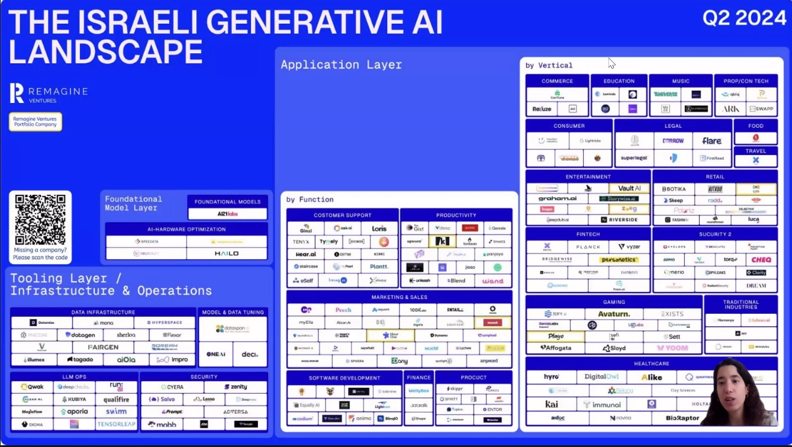

- Mostly LLMs usage, model training is not common yet.


## Generative vs. Discriminative

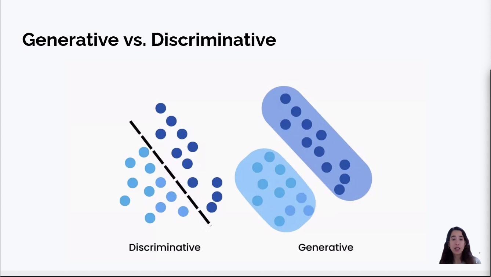

- Generative models learn the joint probability distribution $P(x, y)$ and can generate new data samples.
- Discrimitative models learn the conditional probability distribution $P(y|x)$ and can classify data samples.

## Bias Variance Tradeoff - Regression

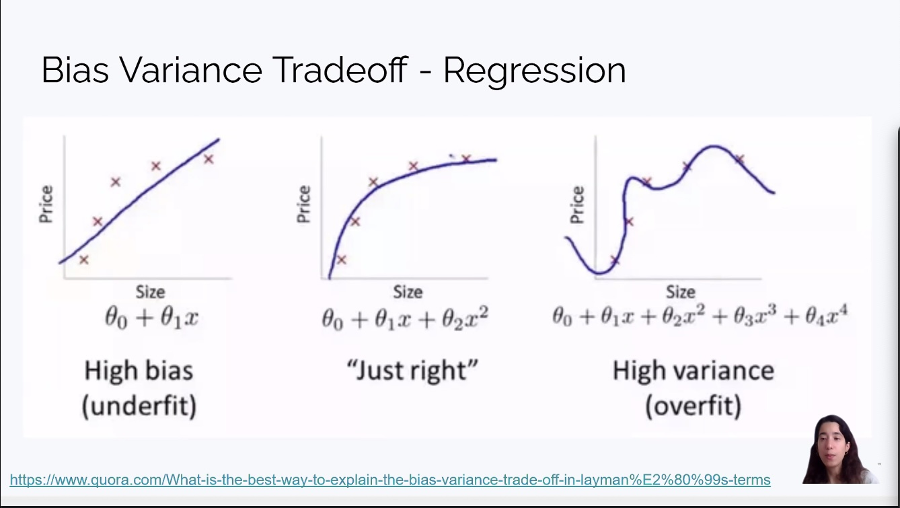

- Regression (a discriminative task) where the goal is to find the best boundary or function to map inputs ($x$) to a specific output ($y$) for classification or prediction.

## Supervised Learning

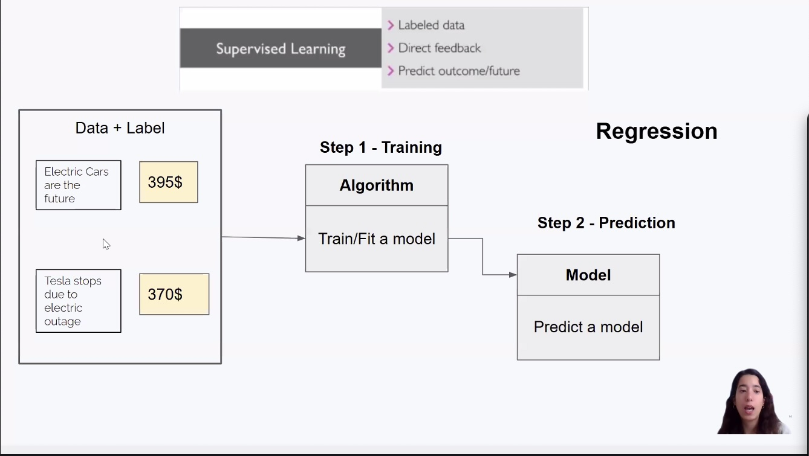

- (Regression): Uses labeled data to train an algorithm that predicts continuous numerical outcomes (e.g., stock price based on news).

## Unsupervised Learning

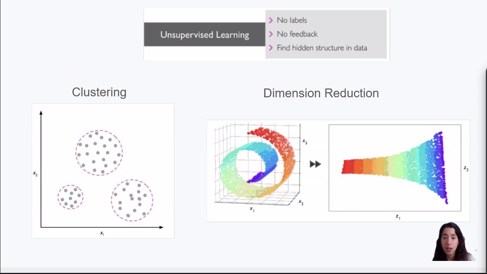

- Analyzes unlabeled data to find hidden structures through Clustering (grouping similar items) or Dimension Reduction (simplifying complex data).

## Reinforcement Learning

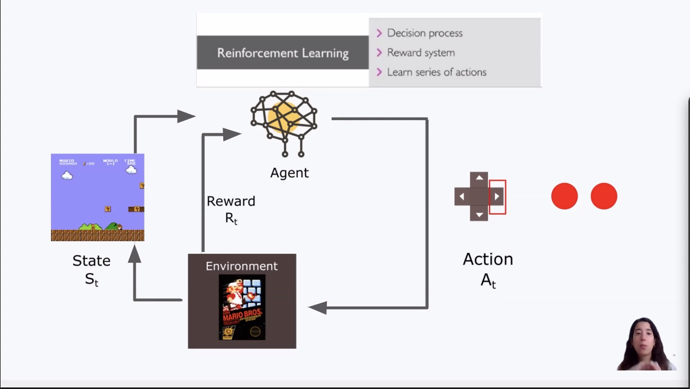

- An Agent learns to make a series of Actions in an Environment to maximize a Reward through trial and error (e.g., a bot learning to play Mario).


## Classification Metrics

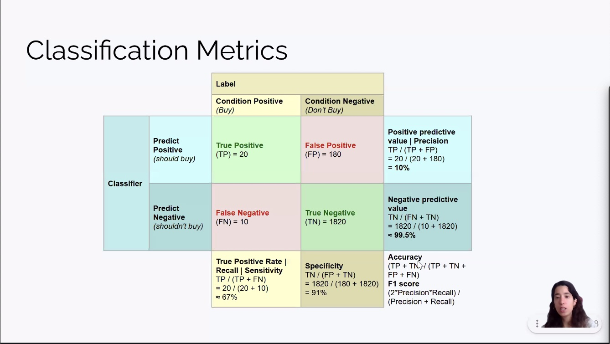

- **Confusion Matrix & Metrics**<br />
Core Logic: Compares Actual Labels (Condition) vs. Model Predictions to identify correct hits (TP, TN) and specific errors (FP, FN).

- **Precision** (10%): Out of all positives, how many were correct?

- **Negative Predictive Value**: Out of all negatives (1820) it was correct 99.5%.

- **Recall / Sensitivity** (67%): Out of all actual "Buys", how many did the model catch?

- **Specificity** (91%): Out of all actual "Don't Buys", how many did the model catch?

- **Accuracy**: Overall correctness across all classes; can be misleading if data is imbalanced (as seen here with many TNs).<br/>
**F1 Score**: The harmonic mean of Precision and Recall, used to find a balance between the two.

***


- Based on the values in the table (TP=20,TN=1820,FP=180,FN=10):

- Accuracy: 90.64% ($\frac{20 + 1820}{2030}$)
- F1 Score: 17.39% ($2 \times \frac{0.1 \times 0.67}{0.1 + 0.67}$)<br />The harmonic mean of Precision and Recall. It provides a balanced single score that is much more reliable than accuracy when classes are imbalanced (as seen here with the high number of "Don't Buy" samples).

- Conclusion: Accuracy is misleadingly high (90%+) because the model is good at saying "no." The low F1 Score (17.4%) reveals the model is actually performing poorly at its main goal: correctly identifying "Buy" opportunities.

## Transformer-based LLM Architecture

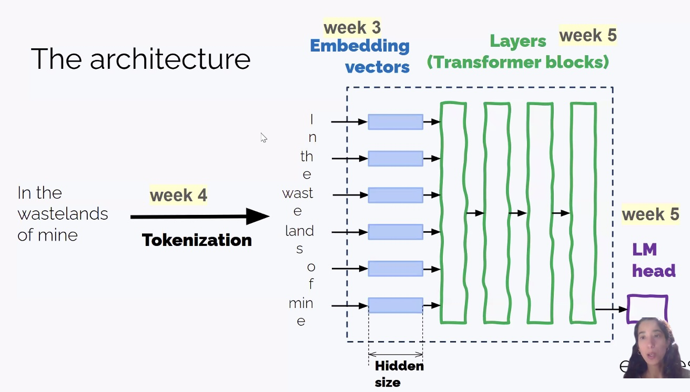

### Key Concepts

- **Tokenization**: Breaks raw text (e.g., "In the wastelands...") into smaller units or "tokens" that the model can process.

- **Embedding Vectors**: Converts tokens into high-dimensional numerical vectors, capturing their initial semantic meaning.

- **Hidden Size**: The dimensionality of these vectors (the "width" of the model).

- **Layers (Transformer Blocks)**: A series of stacked layers that use Self-Attention to understand the context and relationships between all tokens in the sequence.

- **LM Head (Language Modeling Head)**: The final layer that maps the processed data back into a probability distribution to predict the next token in the sequence.

***

## Could we just count and divide?

### P(blue The water of Walden Pond is so beautifully) = C(The water of Walden Pond is so beautifully blue) / C(The water of Walden Pond is so beautifully)

Technically yes, this is the foundation of N-gram language models, but it fails in practice for two main reasons:

- The Sparsity Problem: As the sentence gets longer, the probability of seeing that exact sequence of words in your training data becomes near zero. You can't divide by zero ($C=0$), so the model "breaks."

- Storage/Computation: To "count and divide" for all possible long sentences, you would need a database larger than the physical universe.

## Benchmarks

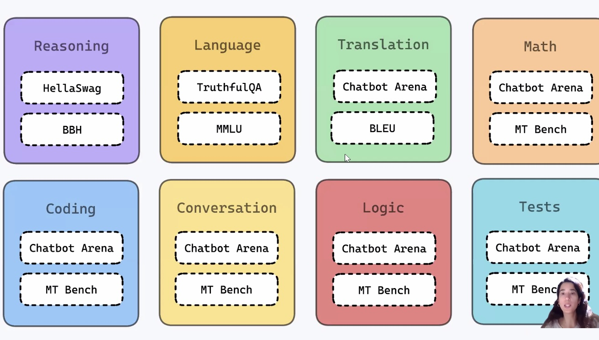

###  MMLU (Massive Multitask Language Understanding) - designed to be exceptionally difficult, often described as a "general knowledge exam" for AI that spans from high school to advanced professional levels.

## Types of ML

### Supervised Learning:

- Uses labeled data and direct feedback.
- Goal is to predict outcomes or future values.

### Unsupervised Learning:

- Works with no labels and no feedback.
- Goal is to find hidden structure or patterns in data.

### Reinforcement Learning:

- Functions as a decision process using a reward system.
- Goal is to learn a series of actions to maximize rewards.

## Supervised Learning

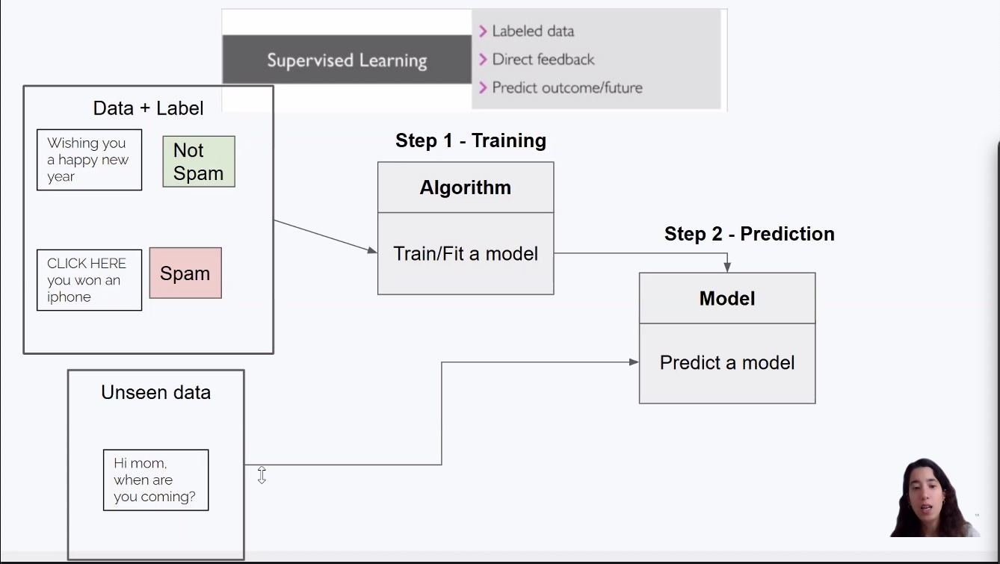
***

## Challenges with LLMs
- Reproducibility
- Hallucinations
- Safety (Toxicity)
- Bias & Ethics
- Costs and Quotas

## Evaluation

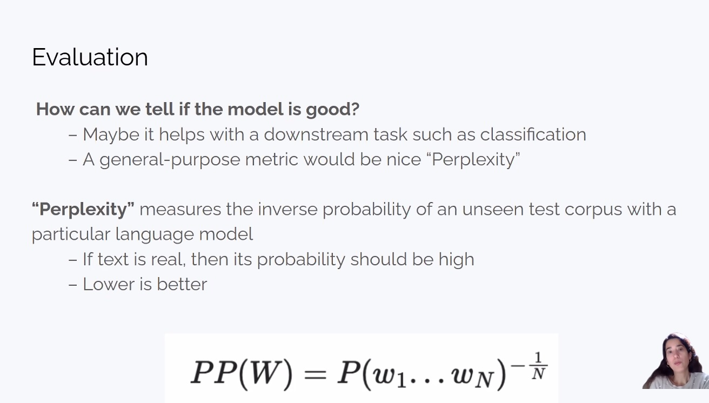

Perplexity (inability to understand) is a measure of how "surprised" a language model is by a sequence of text. Lower is less "perplexed", so lower == better.

## HellaSwag

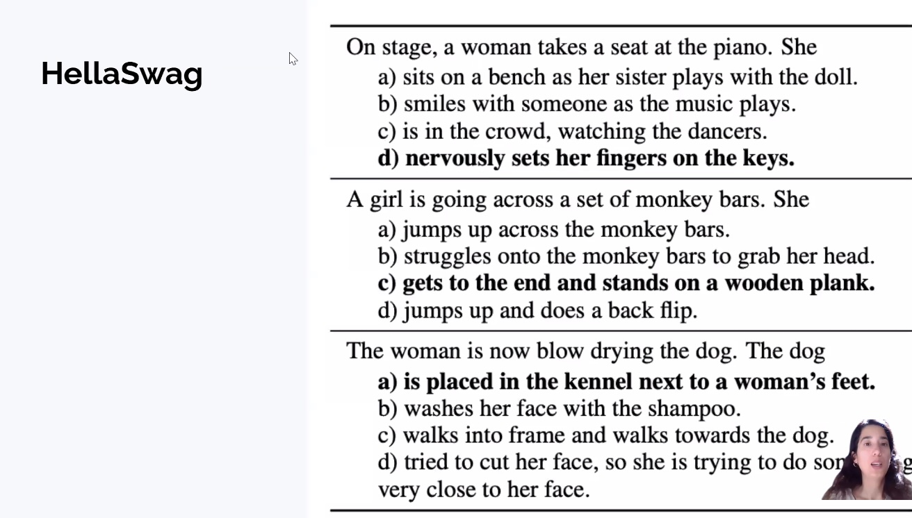

- HellaSwag is a benchmark designed to test "common sense" reasoning in AI. While many models can memorize facts or solve math problems, they often struggle with everyday logic—specifically, predicting what happens next in a mundane physical scenario.

## Large Language Model Market Size 2024 to 2034 (USD Billion)

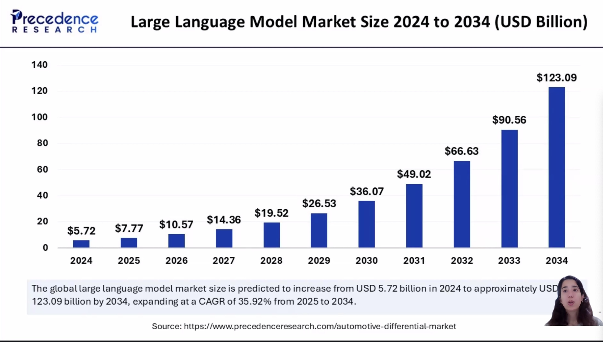


## Key Takeaways

## N-gram language models

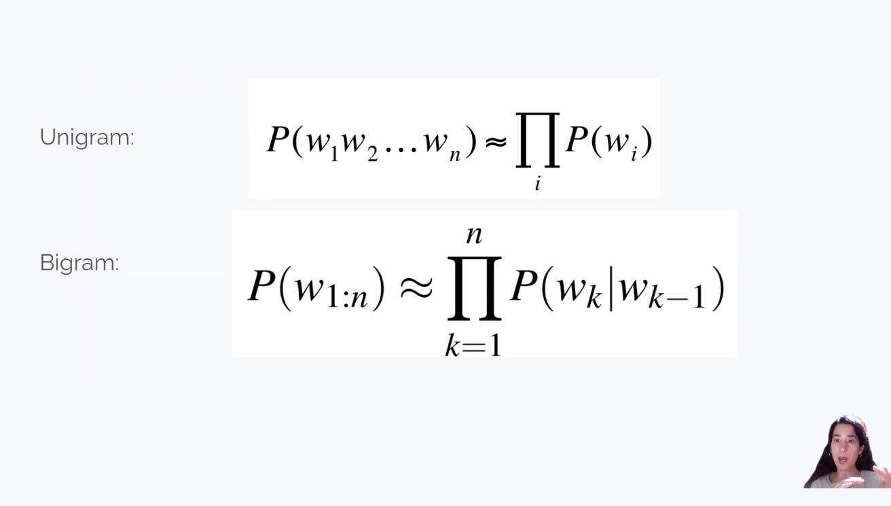

- **Unigram Model**: Assumes each word is independent, calculating the total probability as the product of the individual probability of every word in the sequence:
  ```math
  P(w_1w_2...w_n) \approx \prod_{i} P(w_i)


- **Bigram Model**: Follows a first-order Markov assumption, where the probability of a word depends only on the single word immediately preceding it:
  ```math
  P(w_{1:n}) \approx \prod_{k=1}^{n} P(w_k|w_{k-1})

## ROC AUC - Receiver Operating Characteristic - Area Under Curve

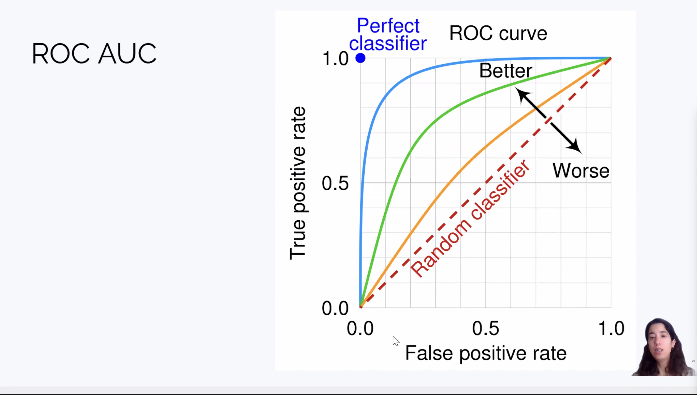

- Key insight: The larger the Area Under the Curve (AUC), the more capable the model is at separating the two classes.
