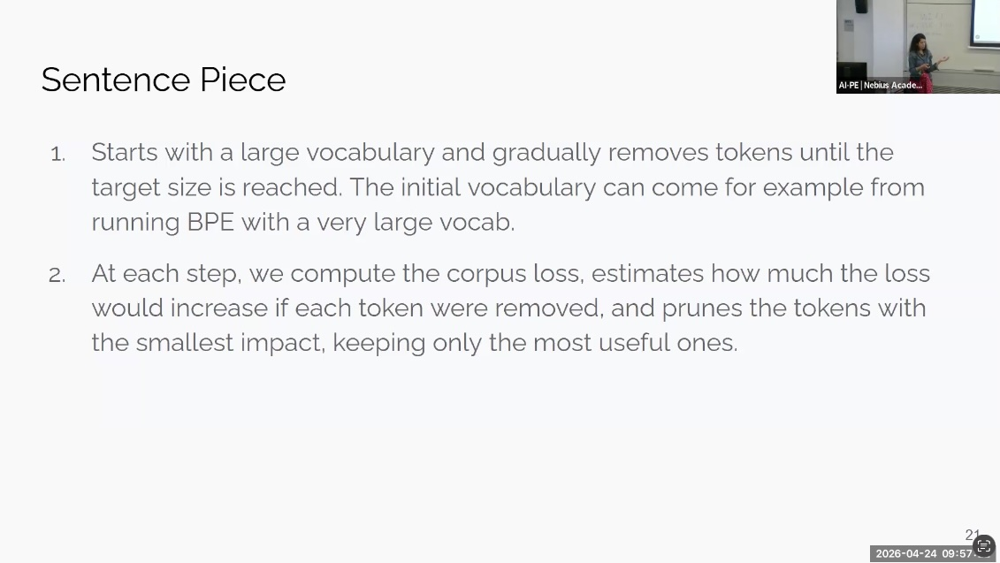
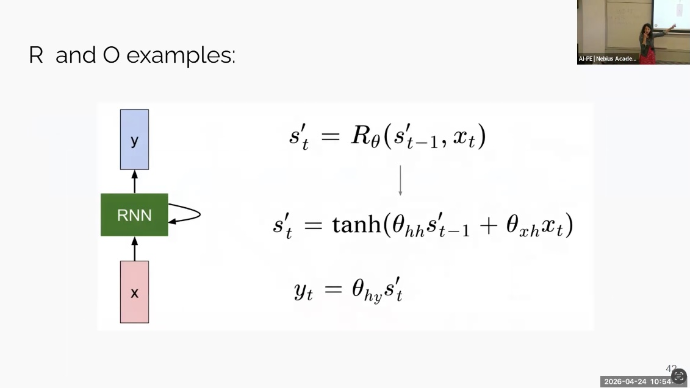
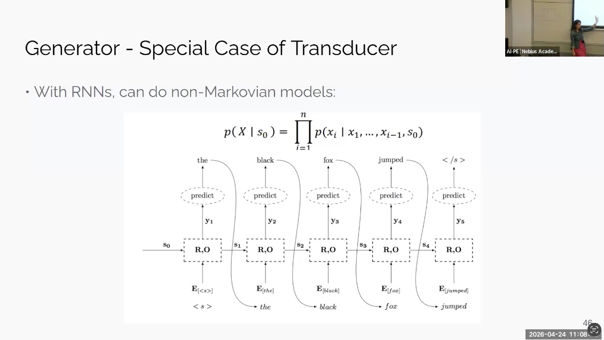

# Topics

- Standardization and Pre-processing
- Character-Level vs. Word-Level Tokenization
- Subword Tokenization (BPE, WordPiece, SentencePiece)
- Domain-Specific Tokenization in Healthcare and Hebrew
- Recurrent Neural Networks (RNN) and Sequential Data
- RNN Architectures: Acceptors, Transducers, and Encoder-Decoders

## Standardization and Pre-processing
- Raw text undergoes a pre-processing phase often called standardization,
which may involve removing punctuation or performing lemmatization (reducing a verb to
its raw form).
- This step is not mandatory and is highly dependent on the specific case or
end goal.

## Character-Level vs. Word-Level Tokenization
- Character-level tokenization treats each character as a token, resulting in a
very small vocabulary but much longer sequence lengths, which increases computational
cost.
- Word-level tokenization uses full words as tokens; it allows for shorter sequence
lengths but requires a very large vocabulary and cannot handle Out-of-Vocabulary (OOV)
words or misspellings.

### Key insights
- Sequence length is critical because calculations and costs in Large Language
Models (LLMs) are often determined per token.
- Character-level models lack built-in semantic knowledge, whereas words already
correspond to meaningful semantic units.

## Subword Tokenization (BPE, WordPiece, SentencePiece)

- Byte Pair Encoding (BPE) starts with characters and iteratively merges the most
frequent adjacent token pairs until a target vocabulary size is reached.
- WordPiece is similar to BPE but selects merges based on a likelihood score
(frequency of the pair divided by the product of individual frequencies) rather than raw
frequency.
- SentencePiece starts with a large vocabulary and gradually removes tokens that
have the smallest impact on the corpus loss.

## Domain-Specific Tokenization
- General-domain tokenizers (like standard BERT) often split complex medical terms
into meaningless fragments (e.g., "hypertension" into "hyper" and "tension"), whereas
in-domain training (e.g., PubMedBERT) allows these to be single tokens.
- In Hebrew, explicit morphological knowledge is vital because prefixes and suffixes
are joined to words (e.g., "in the shade" is one word in Hebrew), making standard
word-piece tokenization less effective than morphological segmentation.

## Recurrent Neural Networks (RNN) and Sequential Data

- RNNs process sequential information where each state is a function of the
previous state and the current input, allowing them to handle varying input lengths
.
- sequential data is characterized by vocabulary/alphabets, time dependence,
locality, and long-distance relations.

## RNN Architectures

- Acceptors: Use the final output of the RNN as a fixed-size vector for tasks
like text classification or sentiment analysis.
- Transducers: Generate an output for every input token, used for tasks like
Named Entity Recognition (NER) or Part-of-Speech tagging.
- Encoder-Decoder: Combines an acceptor (to represent the input) and a transducer
(to generate a new sequence), which is the primary architecture for language translation
and summarization.

### 👉 Next: [Transformers and LLMs](../2_LLM_Architecture/Transformers_and_LLMs.md)