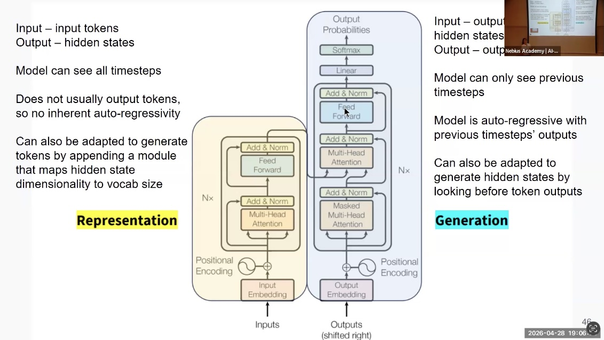
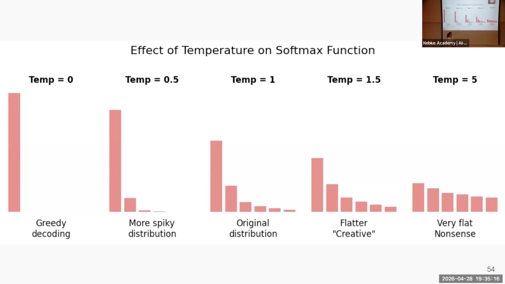

# Topics

- Contextualized vs. Static Embeddings
- The Transformer Architecture: Encoder and Decoder
- Self-Attention and Multi-Head Attention
- Training "Tricks": Skip Connections, Normalization, and Dropout
- Positional Encodings
- LLM Architectures: Encoder-Only, Decoder-Only, and Encoder-Decoder
- Inference Techniques: Top-K, Top-P, and Temperature

## Contextualized vs. Static Embeddings
- Static embeddings (like Word2Vec) map a token to a single vector regardless
of context, failing to distinguish between different meanings of a word like
"bank".
- Contextualized embeddings are created on the fly by integrating information
from neighboring tokens, allowing the model to resolve ambiguities (e.g., determining
if "it" refers to a "chicken" or a "road").

## The Transformer Architecture

- The Transformer is composed of an Encoder that builds dense representations
of the input and a Decoder that generates output tokens.
- It was originally introduced by Google in the 2017 paper "Attention is All
You Need".

## Self-Attention and Multi-Head Attention
- Self-attention allows each token to attend to all other tokens in a layer,
regardless of their position or sequence order.
- Multi-head attention uses multiple parallel attention "heads," each
initialized differently to capture diverse relationships (e.g., syntax vs. semantics)
between tokens.

## Training "Tricks"
- Skip Connections: Bypass layers to prevent information loss and help
gradients flow better in deep networks.
- Layer Normalization: Standardizes values within the network to stabilize
training and prevent numbers from drifting too large or small.
- Dropout: Randomly shuts down neurons during training to prevent the
model from over-relying on specific nodes, which helps avoid overfitting[cite: 812,
818, 819, 825].

## Positional Encodings
- Since self-attention is time-agnostic (it sees all tokens at once), positional
encodings are added to input embeddings to preserve the order of the sequence[cite:
831, 835, 836, 839].

## LLM Architectures
- Encoder-Only (BERT Family): Specialized for understanding tasks like
classification and NER because they see the full context at once[cite: 1013, 1014,
1019, 1020].
- Decoder-Only (GPT Family): Specialized for generative tasks; they use
"masked" self-attention to ensure they only see previous tokens and not future ones
.
- Encoder-Decoder (T5/BART): Ideal for sequence-to-sequence tasks where
one full sequence is mapped to another, such as translation.

## Inference Techniques
- Decoding Strategies: Methods to choose the next token after the model
builds a probability distribution; common strategies include greedy search (highest
probability) or random sampling.
- Top-K and Top-P Sampling: Top-K limits choices to the K most probable
tokens, while Top-P (Nucleus) samples from a set of tokens whose cumulative probability
meets a threshold P.

- Temperature: A parameter that divides logits before softmax to smooth the
distribution; higher temperature increases variation/creativity, while lower temperature
makes the output more robust and deterministic.

[Interactive Transformer Explanation](https://poloclub.github.io/transformer-explainer/)